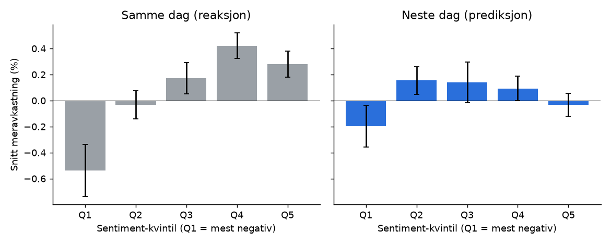
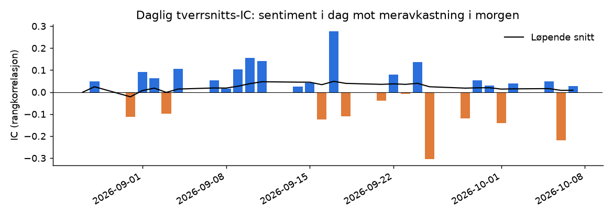
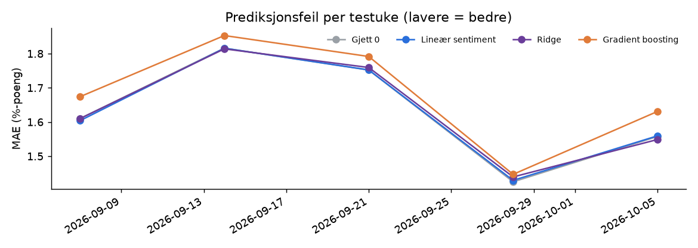

# Forum-sentiment mot avkastning

Generert 2026-10-10 01:27 UTC · 18,456 scorede innlegg · 2,120 aksje-dager · 113 aksjer · 2026-08-27 → 2026-10-07 (30 handelsdager) · marked: OSEBX

## Konklusjon

Sentimentet henger mye tettere sammen med samme dags kurs (0.136) enn neste dags (0.013) – forumet reagerer mest på bevegelser som allerede har skjedd. Neste-dags-sammenhengen (IC 0.009) er ikke statistisk skillbar fra flaks (p = 0.698). Ingen modell slår «gjett 0» på ukjente data ennå – det vanligste utfallet med lite data. Med 30 handelsdager er alt dette foreløpig; ca. 6–12 måneder data trengs før konklusjonene blir solide.

## 1. Reagerer forumet, eller forutsier det?

| Sammenheng | Korrelasjon (Spearman) | p-verdi | n |
|---|---|---|---|
| Sentiment ↔ meravkastning samme dag | 0.136 | 0.000 | 2,119 |
| Sentiment → meravkastning neste dag | 0.013 | 0.562 | 2,120 |
| Sentiment → meravkastning neste 5 dager* | -0.000 | 0.998 | 1,814 |

*5-dagers vinduer overlapper, så p-verdien der er for optimistisk.

## 2. Tverrsnitts-IC og tilfeldighetstest

Snitt daglig IC: **0.009** (t = 0.39, 30 dager, positiv 63 % av dagene).
Tilfeldighetstest (2000 stokkinger): p = **0.698**. Stokkede data gir |IC| over 0.042 i 5 % av tilfellene.

IC over 0,02–0,03 som holder seg over tid regnes som interessant i kvant-verdenen. p under 0,05 betyr at sammenhengen sjelden oppstår av ren flaks.

## 3. Modeller – ut-av-utvalget (walk-forward)

| Modell | MAE | RMSE | R² mot «gjett 0» | Treff på retning | IC | Long–short per dag |
|---|---|---|---|---|---|---|
| Gjett 0 (nullmodell) | 1.65 % | 2.81 % | 0.0000 | – | – | – |
| Gjett snittet | 1.65 % | 2.81 % | -0.0009 | 51.6 % | – | – |
| Lineær: kun snitt-sentiment | 1.65 % | 2.81 % | -0.0013 | 51.4 % | -0.024 | 0.127 % |
| Ridge: alle features | 1.65 % | 2.83 % | -0.0147 | 51.5 % | 0.018 | -0.101 % |
| Gradient boosting (grunne trær) | 1.69 % | 2.87 % | -0.0468 | 50.9 % | 0.019 | -0.061 % |

R² over 0 betyr at modellen bommer mindre enn å bare gjette 0 % meravkastning. Med daglige aksjeavkastninger er selv 0,005 bra – de fleste ekte signaler er svake.

### Overtilpasning: treningsdata vs. ukjente data

| Modell | R² på treningsdata | R² ut-av-utvalget |
|---|---|---|
| Lineær: kun snitt-sentiment | 0.0003 | -0.0013 |
| Ridge: alle features | 0.0190 | -0.0147 |
| Gradient boosting (grunne trær) | 0.1286 | -0.0468 |

Stort gap = modellen har lært støy i treningsdataene som ikke gjentar seg.

## Kjente svakheter

- Scraperen ser bare de ~10 nyeste innleggene per aksje per kjøring, og GitHub hopper over noen timer. Travle dager er derfor underrepresentert.
- Tidspunkt er estimert fra «for N t siden» (presisjon ~1 time, «for N døgn siden» ~1 døgn). Vi bruker seneste mulige tidspunkt, så signaler kan komme en dag for sent, aldri for tidlig.
- Meravkastning = aksje minus indeks (ingen beta-justering). Aksjer med høy beta ser bedre ut i stigende marked.
- Kurser fra Yahoo Finance; noen småaksjer kan mangle eller ha hull.
- Ingen handelskostnader i long–short-tallet. Spread i småaksjer kan alene spise et svakt signal.
- Sentiment er scoret av en språkmodell – den kan feiltolke ironi og forum-slang.

_Dette er en analyse av historiske sammenhenger, ikke en kjøps- eller salgsanbefaling._
